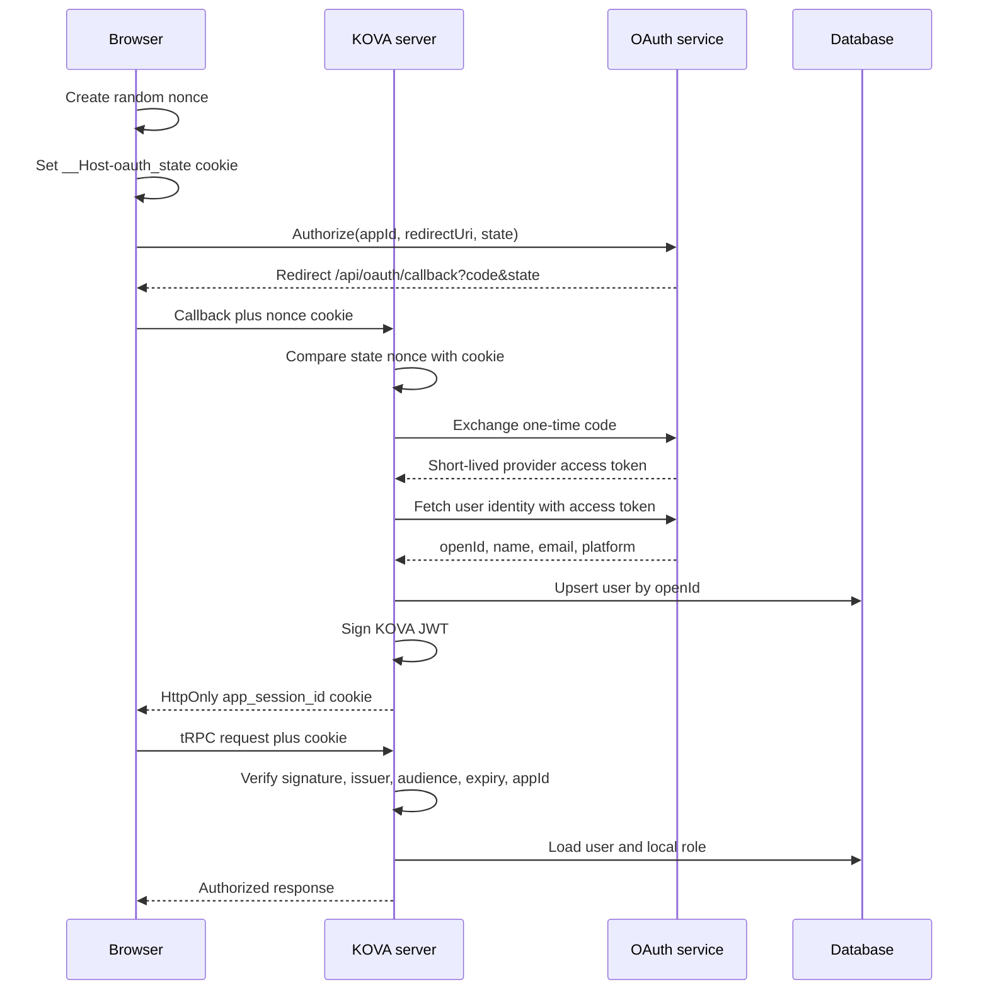

# Authentication architecture

This document describes the authentication implementation in this repository as it exists on the default application path.

## Components

| Component | Code | Responsibility |
|---|---|---|
| Login initiator | `client/src/const.ts` | Creates a one-time nonce, writes the host-only OAuth state cookie, builds the provider authorization URL, and redirects the browser. |
| OAuth callback | `server/_core/oauth.ts` | Validates `code` and `state`, checks the nonce cookie, exchanges the authorization code, fetches the provider identity, upserts the local user, and issues a KOVA session. |
| Provider client and session service | `server/_core/sdk.ts` | Calls the external OAuth service, normalizes login method, signs and verifies KOVA JWTs, and maps a verified identity to a database user. |
| Cookie policy | `server/_core/cookies.ts` | Defines the HttpOnly, Secure, path, and SameSite behavior of the KOVA session cookie. |
| Request context | `server/_core/context.ts` | Attempts authentication for every tRPC request and exposes the resulting user, or `null` for public procedures. |
| Authorization middleware | `server/_core/trpc.ts` | Enforces signed-in access for protected procedures and role `admin` for admin procedures. |
| Browser API client | `client/src/main.tsx` | Sends cookies with tRPC requests and redirects to login after an unauthenticated response. |
| Identity store | `drizzle/schema.ts` | Stores the stable provider `openId`, profile fields, login method, local role, and timestamps. It does not store provider access tokens or KOVA JWTs. |

## Interactive request flow

## Credentials and tokens

| Value | Source | Where used | Persistence and exposure |
|---|---|---|---|
| `VITE_APP_ID` | Deployment environment; public client identifier | Browser authorization URL, server token exchange, JWT audience/app binding | Included in client builds; it is an identifier, not a secret. |
| `VITE_OAUTH_PORTAL_URL` | Deployment environment | Browser redirect target | Included in client builds; not a secret. |
| `OAUTH_SERVER_URL` | Server environment | Server-to-server token and identity calls | Server only. |
| `JWT_SECRET` | Secret manager/deployment environment | HS256 session signing and verification | Server only; never commit it or expose it through a `VITE_` variable. Minimum 32 characters is enforced. |
| Authorization code | OAuth callback query | Exchanged once by the server | Ephemeral; not stored. Do not log callback URLs. |
| Provider access token | OAuth exchange response | Server calls `GetUserInfo` | Held in server memory only for the identity lookup; not written to the database or returned to the browser. |
| OAuth state nonce | Browser-generated random UUID | Binds callback to the browser that started login | Ten-minute Secure `__Host-` cookie; cleared after validation. It is a CSRF correlation value, not an access credential. |
| KOVA session JWT | KOVA server | Authenticates API requests | Seven-day signed bearer token in an HttpOnly cookie. Production code does not read it through JavaScript. |
| `DATABASE_URL` | Secret manager/deployment environment | Database connection | Server only. It may contain database credentials and must never be committed. |
| `BUILT_IN_FORGE_API_KEY` | Secret manager/deployment environment | Server-side Forge integration | Server only; separate from user authentication. |

## Authorization model

Authentication establishes who the caller is. Authorization is applied afterward:

- `publicProcedure` may run with `ctx.user === null`.
- `protectedProcedure` requires a verified session and a database user.
- `adminProcedure` additionally requires the local database role to equal `admin`.
- User-owned records and stored files are queried with `ctx.user.id`, preventing callers from selecting another user ID directly.

The provider identity is keyed by `openId`; the application role remains local. A provider login method such as Google, Microsoft, Apple, email, or GitHub does not itself grant KOVA administrator access.

## Operational requirements

Configure secrets in the deployment platform, not in Git, Drive documents, client code, issue comments, or build logs. Use a cryptographically random `JWT_SECRET` of at least 32 bytes, rotate it after suspected exposure, and expect rotation to sign every user out. Register the exact callback for each deployed origin, for example `https://kovaos.com/api/oauth/callback`.

Before production deployment:

1. Confirm HTTPS is enforced at the edge.
2. Set `VITE_APP_ID`, `VITE_OAUTH_PORTAL_URL`, `OAUTH_SERVER_URL`, `JWT_SECRET`, and `DATABASE_URL`.
3. Confirm the OAuth provider allow-lists the exact `kovaos.com` callback.
4. Run `pnpm check`, `pnpm test`, and `pnpm build`.
5. Verify login, logout, expired-session rejection, wrong-audience rejection, and protected/admin procedure behavior.
6. Keep the development-only Bearer fallback disabled in production.

## Known follow-up work

- Add server-side session revocation and refresh-token rotation if KOVA needs long-lived sessions.
- Add automated tests for nonce replay, expired/wrong-audience JWTs, cookie attributes, logout, and authorization boundaries.
- Add rate limiting and security event telemetry around callback and failed session verification.
- Replace the Manus-specific provider adapter behind a stable KOVA identity interface before adding more providers.
